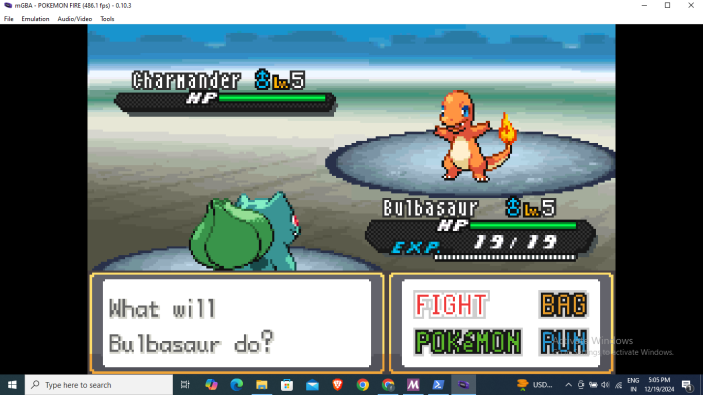

# Work in PROGRESS (WIP) 

 This code enhances the battle engine adding a battle textbox and lighting moves , FIGHT/RUN/POKEMON/BAG options
 Here is the commit I'm referring from : https://github.com/CompuMaxx/TerranovaFR/commit/c19e217d1433d19eb881d4c3b9747ff2e09dd3fd#diff-8285206d44f04f5565566dff2c866e07110570a2a52150600df763d183ccd9fd

